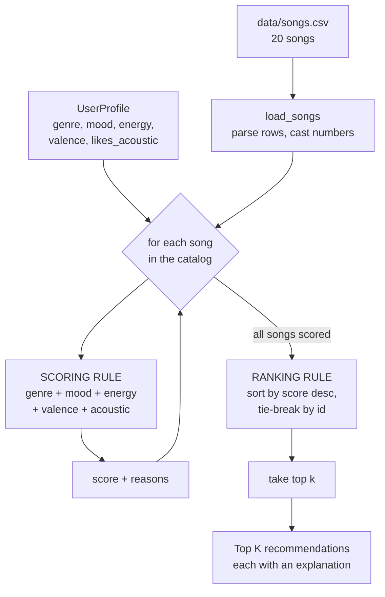

# 🎵 Music Recommender Simulation

## Project Summary

In this project you will build and explain a small music recommender system.

Your goal is to:

- Represent songs and a user "taste profile" as data
- Design a scoring rule that turns that data into recommendations
- Evaluate what your system gets right and wrong
- Reflect on how this mirrors real world AI recommenders

**My version** is a content-based music recommender built on a 20-song catalog.
The user describes the kind of music they want — a genre, a mood, a target energy
level, and whether they prefer acoustic or produced sound — and the system scores
every song in the catalog against that description, then returns the best
matches ranked highest first. Every recommendation comes with a plain-language
explanation of *why* it was chosen, because the score is assembled from named
features rather than a black-box model.

The design choice I care most about is that numeric features are scored by
**closeness rather than magnitude**: a user asking for low-energy music gets
genuinely calm songs, instead of being handed the most intense track in the
catalog. I also deliberately excluded `tempo_bpm` and `danceability` after
finding they are almost perfectly correlated with `energy` in this dataset —
including them would have quietly counted the same signal four times.

---

## How The System Works

### How real recommenders work, and what mine does instead

Real platforms like Spotify and YouTube lean mostly on **collaborative
filtering**: they ignore what a song sounds like and instead learn from the
behavior of millions of listeners — plays, skips, saves, and especially which
songs people put in the same playlists. If lots of people who play song X also
play song Y, the system links X and Y without ever analyzing the audio. That
works extremely well at scale, but it needs an enormous amount of interaction
data, and it can't recommend a song nobody has played yet.

My simulator has no listening history at all — just a catalog of 20 songs and
their attributes — so it uses the other pillar, **content-based filtering**. It
compares the *properties of each song* against a user's stated preferences and
scores the match. This means it can recommend a brand-new song the moment it is
added to the CSV, and it can explain every recommendation in plain language,
since every point in the score comes from a named feature. The trade-off is that
it can only ever suggest things similar to what the user already asked for — it
has no way to discover that two songs belong together for cultural reasons its
columns don't capture.

**What my version prioritizes:** matching the *situation* over matching
popularity. I weight genre and mood most heavily, then how closely a song's
energy matches the user's target, and I treat "close to your target energy" as
better than "high energy" — so a user looking for calm music gets calm music
rather than the most intense track in the catalog.

### Features used

I checked the correlations between the numeric columns before choosing. In the
original 10-song catalog, `tempo_bpm` (+0.96), `danceability` (+0.86) and
`acousticness` (−0.99) were almost perfectly correlated with `energy` — scoring
all of them would just have counted energy four times and drowned out genre and
mood, so I deliberately use only a subset.

Expanding the catalog to 20 songs weakened those correlations
(`acousticness` −0.99 → −0.72, `danceability` +0.86 → +0.69), but `tempo_bpm`
stayed redundant at +0.91, so it remains excluded.

**`Song` uses:**

| Feature | Type | Role in scoring |
|---|---|---|
| `genre` | categorical | Exact match scores highest; partial match (`indie pop` for `pop`) scores partial credit |
| `mood` | categorical | Exact match bonus |
| `energy` | float 0–1 | Compared by *closeness* to the user's target |
| `valence` | float 0–1 | Compared by closeness; the only numeric not correlated with energy, so it separates "intense and happy" from "intense and dark" |
| `acousticness` | float 0–1 | Read through the user's acoustic preference rather than scored directly |
| `id` | int | Not a feature — used only as a stable tie-breaker |
| `title`, `artist` | text | Display only |

Deliberately excluded: `tempo_bpm` and `danceability` (redundant with energy).

**`UserProfile` stores:**

| Field | Type | Meaning |
|---|---|---|
| `favorite_genre` | str | Preferred genre |
| `favorite_mood` | str | Preferred mood |
| `target_energy` | float 0–1 | The energy level being aimed for — not a minimum |
| `likes_acoustic` | bool | Whether acoustic production is a plus or a minus |
| `target_valence` | float 0–1 | How positive/upbeat the user wants the music. Added to the starter profile; defaults to 0.5 so existing code keeps working |

### Example User Profile

```python
user_prefs = {
    "favorite_genre": "lofi",     # categorical
    "favorite_mood":  "chill",    # categorical
    "target_energy":  0.35,       # 0-1, a target to sit near, not a minimum
    "target_valence": 0.55,       # 0-1, how upbeat the user wants it
    "likes_acoustic": True,       # bool, flips how acousticness is read
}
```

### Data Flow



In one line: **Input** (user prefs) → **Process** (loop scoring every song
independently) → **Output** (sort, cut to k, explain).

### Algorithm Recipe — Scoring Rule (one song)

Each song accumulates points from independent terms:

```
score = genre_points          # 2.0 exact match, 1.0 partial match, else 0
      + mood_points           # 1.5 if the mood matches, else 0
      + 1.5 * (1 - |song.energy  - user.target_energy|)
      + 0.5 * (1 - |song.valence - user.target_valence|)
      + acoustic_points       # 1.0 * acousticness, or 1.0 * (1 - acousticness)
```

| Term | Weight | Contributes |
|---|---|---|
| Exact genre match | +2.0 | 0 or 2.0 |
| Partial genre match (`indie pop` for `pop`) | +1.0 | 0 or 1.0 |
| Mood match | +1.5 | 0 or 1.5 |
| Energy closeness | ×1.5 | 0.0 – 1.5 |
| Valence closeness | ×0.5 | 0.0 – 0.5 |
| Acoustic preference | ×1.0 | 0.0 – 1.0 |
| **Maximum possible** | | **6.5** |

Categorical terms max out at 3.5 and numeric terms at 3.0, so neither kind of
signal can completely overpower the other.

The energy term is the important one. Using the *difference* rather than the raw
value means the score peaks when the song matches the user's target and falls off
in **both** directions — a 0.30 and a 0.50 song score identically against a 0.40
target. Scoring raw energy instead would recommend the single most intense track
in the catalog to everyone.

Genre is weighted above mood because a genre mismatch is the more serious error:
a listener who asks for lofi and is handed intense rock rejects it outright,
while a listener who wants "chill" and gets a "relaxed" jazz track is usually
satisfied. The weights are kept close together on purpose — a very large genre
weight would turn the recommender into a genre filter with no variety.

### Ranking Rule (the list)

Scoring answers "how well does this one song fit?" — but a score of 4.2 means
nothing on its own. The **ranking rule** turns scores into an actual
recommendation:

1. Score every song in the catalog.
2. Sort by score, highest first.
3. Break ties by `id`, so results are stable and reproducible.
4. Return the top `k`.

Keeping these separate matters because ranking involves decisions a single-song
function structurally cannot make — how many results to return, what breaks a
tie, and whether the same artist should be allowed to fill the whole list. Those
are all list-level concerns. Real recommenders make the same split: scoring is
their ranking model, and this step is their re-ranking stage, where diversity and
freshness rules are applied.

### Biases I Expect Before Writing the Code

Recording these in advance so I can check afterwards whether they actually
appeared, rather than rationalizing whatever the system produces.

**1. Genre over-prioritization.** At +2.0, genre is the single largest term. A
song that nails the user's mood and energy but sits in the wrong genre can lose
to a same-genre song that matches nothing else. The system will likely bury good
cross-genre matches. *Check:* find a case where a mood-and-energy match loses to
a genre-only match, and see whether I agree with the ranking.

**2. A cliff after the first result in sparse genres.** 13 of my 16 genres have
only one song. Testing a folk/melancholy profile gave 6.41 for the one folk
track, then 2.71 for the next — everything past #1 is chosen almost entirely by
energy, so the tail of the list is close to "any quiet song." The system will
look confident while returning near-arbitrary results.

**3. Mood may be decorative.** Testing mood weights of 1.0 vs 1.5 produced
*identical* rankings; only at 2.0 did anything move. Mood may be acting as a
tie-breaker rather than a real signal, which would mean one of my two headline
features is barely doing work.

**4. Middle-of-the-road songs get a floor.** Because energy and valence use
`1 − |difference|`, a song always earns *some* points, and songs near 0.5 on
every axis are never far from anyone. Bland songs may quietly out-rank
distinctive ones that miss slightly.

**5. Popularity bias is absent — and that is itself notable.** With no play
counts, this system cannot favor popular songs, which real recommenders
notoriously do. That's a genuine advantage of the content-based approach here,
not something I designed around.

**6. My weights encode one theory of taste, applied to everyone.** Deciding
genre matters more than mood is a claim about how *all* listeners work. Someone
who picks music purely by mood gets a system tuned against them, and nothing in
the profile lets them say so.

---

## Getting Started

### Setup

1. Create a virtual environment (optional but recommended):

   ```bash
   python -m venv .venv
   source .venv/bin/activate      # Mac or Linux
   .venv\Scripts\activate         # Windows

2. Install dependencies

```bash
pip install -r requirements.txt
```

3. Run the app:

```bash
python -m src.main
```

### Running Tests

Run the starter tests with:

```bash
pytest
```

You can add more tests in `tests/test_recommender.py`.

---

## Sample Recommendation Output

Actual terminal output from `python -m src.main` using the default pop/happy
profile:

```
Loaded songs: 20

====================================================================
  Profile: pop / happy | energy 0.80 | valence 0.70 | produced
====================================================================

1. Sunrise City - Neon Echo
   Score: 6.22   [pop / happy]
     - genre match: pop (+2.0)
     - mood match: happy (+1.5)
     - energy 0.82 vs target 0.80 (+1.47)
     - valence 0.84 vs target 0.70 (+0.43)
     - produced sound (+0.82)

2. Rooftop Lights - Indigo Parade
   Score: 5.04   [indie pop / happy]
     - partial genre match: indie pop (+1.0)
     - mood match: happy (+1.5)
     - energy 0.76 vs target 0.80 (+1.44)
     - valence 0.81 vs target 0.70 (+0.44)
     - produced sound (+0.65)

3. Gym Hero - Max Pulse
   Score: 4.72   [pop / intense]
     - genre match: pop (+2.0)
     - energy 0.93 vs target 0.80 (+1.30)
     - valence 0.77 vs target 0.70 (+0.46)
     - produced sound (+0.95)

4. Ocean Bus Route - Kito Lamar
   Score: 4.08   [afrobeats / happy]
     - mood match: happy (+1.5)
     - energy 0.74 vs target 0.80 (+1.41)
     - valence 0.88 vs target 0.70 (+0.41)
     - produced sound (+0.76)

5. Mud and Thunder - Redbird Holler
   Score: 3.44   [bluegrass / happy]
     - mood match: happy (+1.5)
     - energy 0.87 vs target 0.80 (+1.40)
     - valence 0.81 vs target 0.70 (+0.44)
     - produced sound (+0.10)
```

**Does this match expectations?** Yes — `Sunrise City` is the only song that is
both pop *and* happy at roughly the right energy, and it wins by a clear margin.
`Rooftop Lights` placing second is the partial-genre rule working as designed.

**It also confirms bias #1 straight away.** `Gym Hero` (pop, but *intense*) beats
`Ocean Bus Route` (happy, but afrobeats) 4.72 to 4.08 — a genre-only match
outranks a mood-only match, exactly as predicted. Whether that is right depends
on the listener: someone who searched for "happy" music may be unimpressed to be
handed a gym track third.

**Screenshot or video** *(optional)*: <!-- Insert a screenshot or demo video link here -->

---

## Experiments You Tried

I tested five profiles — Pop Fan, Lofi Student, Metalhead, Sad Folk and Jazz
Chill — under three weight configurations, and measured how many of the 15 top-3
slots (5 profiles × 3 slots) actually changed.

### Experiment A — halve genre (2.0 → 1.0), double energy (1.5 → 3.0)

**Result: only 2 of 15 slots changed.** Three of the five profiles were
completely unaffected.

| Profile | Change |
|---|---|
| Pop Fan | `Gym Hero` → `Ocean Bus Route` |
| Lofi Student | `Focus Flow` → `Spacewalk Thoughts` |
| Metalhead, Sad Folk, Jazz Chill | no change |

**More accurate, or just different?** Mostly neither — it barely moved. But the
one meaningful change was an *improvement*: the pop fan's third slot went from
`Gym Hero` (pop, but intense) to `Ocean Bus Route` (genuinely happy). Someone
asking for happy pop probably wants the upbeat song over the gym track.

The bigger lesson was that my weights matter far less than I assumed. The #1
result is always the single song matching both genre and mood, and it wins by
such a margin that reweighting cannot dislodge it. **The dataset shape dominates
the scoring rule.**

### Experiment B — remove the mood check entirely (weight 1.5 → 0.0)

**Result: 1 of 15 slots changed.** Deleting one of my two headline categorical
features was almost undetectable.

The clearest evidence: with mood removed, the pop fan's `Sunrise City` and
`Gym Hero` tie at *exactly* 4.72, and the order is decided by song ID. Mood's
real job in this system is breaking ties between songs that already agree on
genre and energy — not steering results.

This directly contradicts predicted bias #3, which I had listed as a
possibility rather than an expectation. It is now the strongest finding in the
model card.

### Score-cliff measurements

| Profile | 1st | 3rd | Drop |
|---|---|---|---|
| Pop Fan | 6.22 | 4.72 | 1.50 |
| Lofi Student | 6.33 | 4.68 | 1.65 |
| Metalhead | 6.41 | 4.16 | 2.25 |
| **Sad Folk** | 6.41 | 2.67 | **3.74** |
| **Jazz Chill** | 6.35 | 2.81 | **3.54** |

Profiles whose genre has neighbours in the catalog (pop/indie pop, lofi×3)
degrade gently. Profiles in single-song genres fall off a cliff after the one
exact match, and everything below is chosen almost entirely by energy. This
confirms predicted bias #2.

### What I did not test

I left `tempo_bpm` and `danceability` out of the scoring rule throughout, on the
correlation evidence from Phase 2, so I have no experimental data on what adding
them would do. Given how little the weight changes mattered, I suspect the answer
is "very little" — but that is a prediction, not a result.

---

## Limitations and Risks

- **Tiny catalog.** 20 songs, and 13 of the 16 genres contain only one song.
- **It fails silently for rare taste.** A folk listener's scores drop 3.74 points
  from 1st to 3rd; a pop listener's drop 1.50. Both get five confident-looking
  results, but only one list is meaningful. Measured, not guessed — see
  Experiments above.
- **Mood barely does anything.** Removing it changed 1 of 15 top-3 slots.
- **No way to express dislikes.** Only positive preferences exist, so an unwanted
  genre keeps reappearing whenever its energy happens to match.
- **One favorite genre and mood per user.** Real taste is a mix, not a single
  string.
- **No understanding of lyrics, language, artist familiarity, or release date.**
  Two songs with identical numbers are interchangeable to this system.
- **No diversity control.** Nothing stops one artist or genre filling the list.

Full detail, including the fairness angle, is in [`model_card.md`](model_card.md).

---

## Reflection

Read and complete `model_card.md`:

[**Model Card**](model_card.md)

**On how recommenders turn data into predictions:** a recommendation is just
arithmetic over attributes plus a sort. There is no understanding of music
anywhere in my system — it compares numbers and strings, adds up points, and puts
the biggest number first. What surprised me is how much of the outcome was
already decided by the dataset before any of my scoring logic ran. I halved the
genre weight and doubled the energy weight and only 2 of 15 results moved;
deleting the mood check moved 1. The weights I agonised over were the least
important part. The catalog's shape did the real work, because most of my genres
contain a single song, so the winner was fixed before the weighting mattered.

**On bias and unfairness:** the failure I found is not that the system is wrong —
it is that it fails *unevenly and invisibly*. It works well for listeners whose
taste is well represented in the catalog and poorly for everyone else, and it
presents both cases with identical confidence: same formatting, same five
results, same explanations. The folk listener has no way to tell that everything
below their first result is essentially "any quiet song." Scaled up, that is how
a recommender ends up serving mainstream taste well and niche taste badly while
appearing to treat everyone the same — and the users being failed are the least
likely to be able to prove it. I also noticed my weights encode one theory of
taste applied to everybody: deciding genre matters more than mood is a claim
about all listeners, and someone who picks music purely by mood gets a system
quietly tuned against them, with no way to say so.


